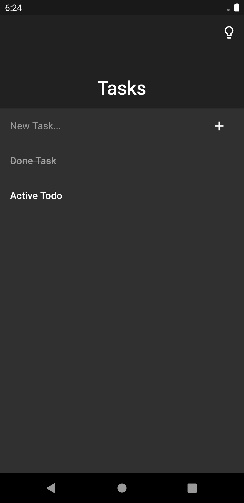
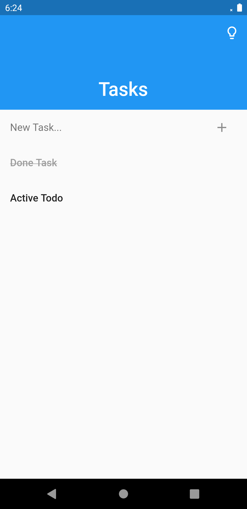

# Simplicity

This app is an example to show how to use ObservableState and GetIt. It is a really simple todo app. The tasks are saved locally to a file as json. So you also see a bit of simple json serialization.

## Screenshots

| Darktheme                       | Lighttheme                       |
| ------------------------------- | -------------------------------- |
|  |  |
